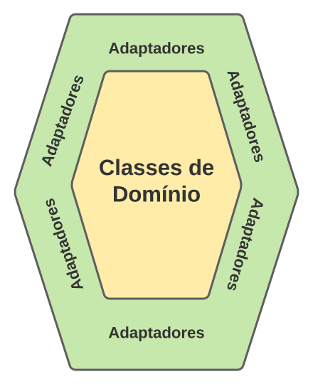
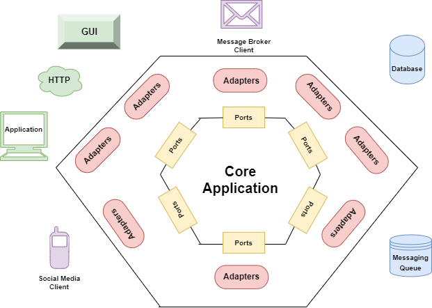
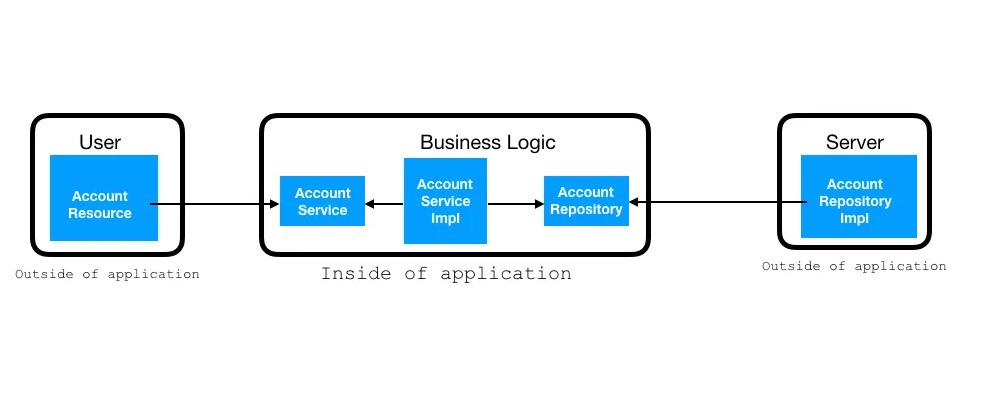

# Eng-Software_CEFETMG_Hexagonal-Architecture
Trabalho 1 de Laboratório de Engenharia de Software - 2023/1 - Arquitetura Hexagonal
# Arquitetura Hexagonal - Engenharia de Software

# 1 O que é uma Arquitetura Hexagonal?

## 1.1 Introdução

O conceito de Arquitetura Hexagonal foi proposto por Alistair Cockburn, em meados dos anos 90, em um [artigo](http://wiki.c2.com/?HexagonalArchitecture) postado na primeira wiki que foi desenvolvida, chamada WikiWikiWeb (cujos artigos tratavam principalmente de temas relacionados com Engenharia de Software).

Os objetivos de uma Arquitetura Hexagonal são parecidos com os de uma Arquitetura Limpa, tal como descrevemos em um outro [artigo](https://engsoftmoderna.info/artigos/arquitetura-limpa.html). Mas, para reforçar, a ideia é construir sistemas que favorecem reusabilidade de código, alta coesão, baixo acoplamento, independência de tecnologia e que são mais fáceis de serem testados.

Uma Arquitetura Hexagonal divide as classes de um sistema em dois grupos principais:

- Classes de domínio, isto é, diretamente relacionadas com o negócio do sistema.
- Classes relacionadas com infraestrutura, tecnologias e responsáveis pela integração com sistemas externos (tais como bancos de dados).

Além disso, em uma Arquitetura Hexagonal, **classes de domínio não devem depender de classes relacionadas com infraestrutura, tecnologias ou sistemas externos**. A vantagem dessa divisão é desacoplar esses dois tipos de classes.

Assim, as classes de domínio não conhecem as tecnologias – bancos de dados, interfaces com usuário e quaisquer outras bibliotecas – usadas pelo sistema. Consequentemente, mudanças de tecnologia podem ser feitas sem impactar as classes de domínio. Talvez ainda mais importante, as classes de domínio podem ser compartilhadas por mais de uma tecnologia. Por exemplo, um sistema pode ter diversas interfaces (Web, mobile, etc).

Em uma arquitetura hexagonal, a comunicação entre as classes dos dois grupos é mediada por **adaptadores**.

Visualmente, a arquitetura é representada por meio de dois hexágonos concêntricos. No hexágono interno, ficam as classes do domínio (ou classes de negócio, se você preferir). No hexágono externo, ficam os adaptadores. Por fim, as classes de interface com o usuário, classes de tecnologia ou de sistemas externos ficam fora desses dois hexágonos.



## 1.2 Adaptadores e Portas

Em uma Arquitetura Hexagonal, o termo **porta** designa as interfaces usadas para comunicação com as classes de domínio (veja que interface aqui significa interface de programação; por exemplo, uma **interface** de Java).

Existem dois tipos de portas:

- **Portas de entrada:** são interfaces usadas para comunicação de fora para dentro, isto é, quando uma classe externa precisa chamar um método de uma classe de domínio. Logo, essas portas declaram os serviços providos pelo sistema, isto é, serviços que o sistema oferece para o mundo exterior.
- **Portas de saída:** são interfaces usadas para comunicação de dentro para fora, isto é, quando uma classe de domínio precisa chamar um método de uma classe externa. Logo, essas portas declaram os serviços requeridos pelo sistema, isto é, serviços do mundo exterior que são necessários para o funcionamento do sistema.

O importante é que **as portas são independentes de tecnologia**. Portanto, elas estão localizadas no hexágono interior.

Por outro lado, os sistemas externos, normalmente, usam alguma tecnologia, seja ela de comunicação (REST, gRPC, GraphQL, etc), de bancos de dados (SQL, noSQL, etc), de interação com o usuário (Web, mobile, etc), etc.

Daí a necessidade de componentes localizados no hexágono mais externo da arquitetura – os **adaptadores** –, os quais atuam de um dos dois modos a seguir:

- Eles recebem chamadas de métodos vindas de fora do sistema e
  encaminham essas chamadas para métodos adequados das portas de entrada.
- Eles recebem chamadas vindas de dentro do sistema, isto é, das classes de domínio, e as direcionam para um sistema externo, tais como um banco de dados, um outro sistema da organização ou mesmo de terceiros.

## 2.1 Exemplo de implementação

Um simples exemplo de implementação dessa arquitetura é usando o SpringBoot2 e o Maven.

Primeiro criamos um headless API para esse propósito. Essa API vai pegar a informação de uma conta pela chamada GET.


## 2.2 Controller or User Adapter

A classe AccountResource é o nosso adaptador. Ele conecta a aplicação do usuário para o núcleo do nosso negócio. Iremos então chamar esses métodos definidos na interface AccountService da classe controladora.

```java
@RestController
@RequestMapping(path = "/api")
public class AccountResource {
  @Autowired
  private AccountService accountService;  
  @GetMapping(path = "/account/{accountNumber}", produces =
  "application/json")
  public ResponseEntity<Account>
  getAccountInfo(@PathVariable("accountNumber") String accountNumber){
    return ResponseEntity.ok(accountService.getAccountInfo(accountNumber));
  }
}
```
## 2.3 Service Interface or Port

Vamos então escrever os métodos abstratos na interface AccountService. 
AccountService é a porta entre o controlador e o núcleo da classe de negócios.

```java
public interface AccountService {
  public Account getAccountInfo (String accountNumber);
}
```
## 2.4 Core Logic

Vamos então escrever a lógica de negócio relacionada à nossa aplicação na classe AccountServiceImpl.
```java
@Service 
public class AccountServiceImpl implements AccountService {
  @Autowired
  private AccountRepository accountRepository;
  @Override
  public Account getAccountInfo(String accountNumber) {
    return accountRepository.findAccount(accountNumber);
  }
}
```

## 2.5 Domain Objects

Agora implementando as classes de domínio. A classe Account vai armazenar o dado do domínio.
```java
public class Account {
  private Integer accountNumber;
  private String accountHolderName;
  private Double balance;
  private AccountType accountType;
  
  public Account() { }
  
  public Account(Integer accountNumber, String accountHolderName, Double balance, AccountType accountType) {
    this.accountNumber = accountNumber;
    this.accountHolderName = accountHolderName;
    this.balance = balance; this.accountType = accountType;
  }
}
```

Criamos então um tipo enumerável AccountType

```java
public enum AccountType {
  SAVINGS, CURRENT;
}
```

## 2.6 Repository Interface or Port

Escrevemos então métodos abstratos na interface AccountRepository

Escrevemos também a Implementação desses métodos na classe adaptadora -- AccountRepositoryImpl.

```java
public interface AccountRepository {
  public Account findAccount(String acctNumber);
}
```

## 2.7 Repository Implementation or Adapter

Escrevemos então os métodos na classe AccountRepositoryImpl. 
Vamos escrever um bloco estático que agiria com uma fonte de dados. Esses blocos estáticos também podem ser substituídos por qualquer outra fonte de dados.

```java
@Repository
public class AccountRepositoryImpl implements AccountRepository {
  private static Map<Integer, Account> accountInfo = new HashMap<>();
  static {
    accountInfo.put(1234, new Account(1234, "Mr. X", 2025.45, AccountType.CURRENT));
    accountInfo.put(5678, new Account(5678, "Mr. Y", 2125.45, AccountType.SAVINGS));
  }
  @Override
  public Account findAccount(String acctNumber) {
    Integer accountNumber = Integer.valueOf(acctNumber);
    if (null != accountInfo.get(accountNumber)) {
      return accountInfo.get(accountNumber);
    }
    return new Account();
  }
}
```

Agora, precisamos executar a nossa aplicação de SpringBoot. Usaremos qualquer cliente de nossa escolha para testar a API. Precisamos passar 1 de 2 valores definidos
no bloco estático como entrada.

## TESTE

Vamos acessar a API -- "http://localhost:8080/api/account/5678"
```json
{"accountNumber":5678,"accountHolderName":"Mr. Y","balance":2125.45,"accountType":"SAVINGS"}
```

## Conclusão

Nesse Roteiro prático, nós aprendemos como deixar a nossa lógica de negócio isolada do usuário e do servidor, demonstrando então a aplicação da Arquitetura Hexagonal.


Membros:

João Victor Dias Gomes [@DiasGomes](https://github.com/DiasGomes)

Pedro Costa Calazans [@pedrocostacalazans ](https://github.com/pedrocostacalazans)

Pedro Henrique Maia Duarte [@Pedro-m-Duarte](https://github.com/Pedro-m-Duarte)

Thales Henrique Bastos Neves [@MasterChief520](https://github.com/MasterChief520)
